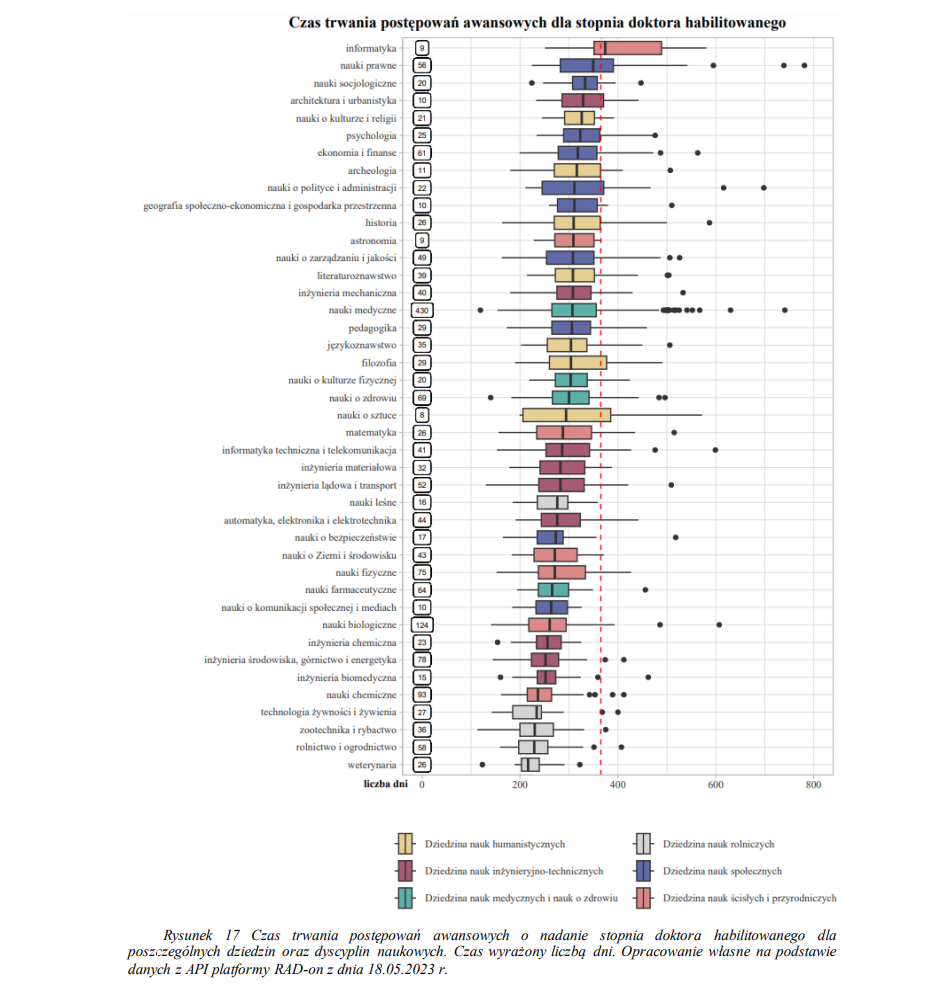
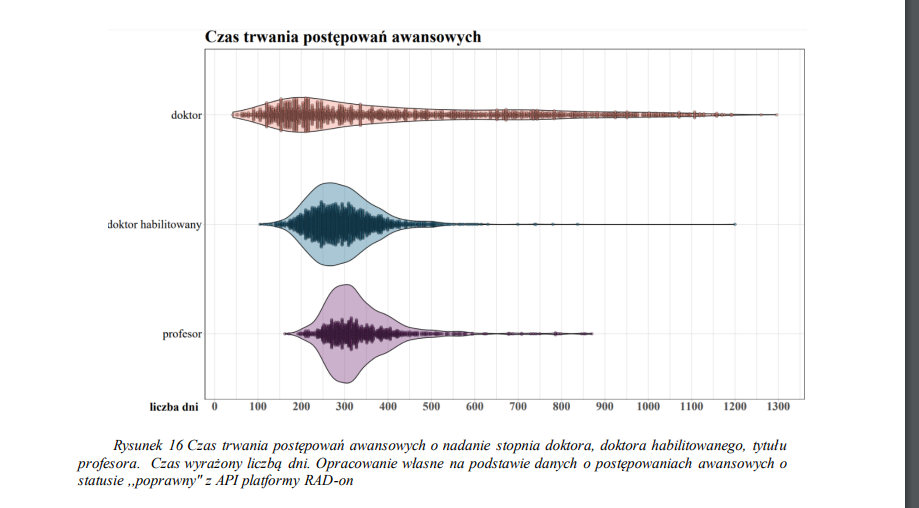
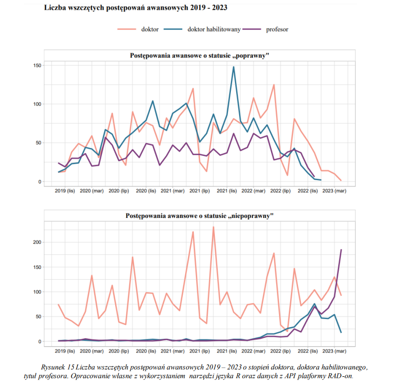

# Brief analysis of RAD-on REST API Selected Resources

The repository contains selected charts from the analysis presented in my bachelor's thesis on RAD on REST APIs. The goal is to showcase my analytical skills by presenting the outputs of my [work](https://apd.polsl.pl/diplomas/14674/).

### RAD-on REST API

​The RAD-on REST API is a publicly accessible interface provided by the Polish Ministry of Science and Higher Education. It offers structured access to extensive datasets concerning higher education, science, and innovation in Poland.​

This API enables users to retrieve data on various aspects such as universities, research institutions, academic staff, students, and scientific activities. By utilizing standard HTTP methods and returning data in formats like JSON, it facilitates integration with applications and supports analytical endeavors.​

For more information and to access the API, you can visit the official documentation page: [RAD-on API Documentation](https://radon.nauka.gov.pl/api/katalog-udostepniania-danych).

### Duration of promotion procedures for the post-doctoral degree in Poland

Duration of promotion proceedings for awarding the post-doctoral degree across various fields and scientific disciplines in Poland. The duration is expressed in number of days. Own elaboration in Polish based on data from the RAD-on platform API as of May 18, 2023.

The fields of social sciences and humanities are characterized by the longest duration of proceedings for awarding the post-doctoral degree. An interesting result concerns the field of agricultural sciences. The disciplines within this field are characterized by clearly the shortest duration of promotion proceedings.

### Duration of promotion procedures in Poland

Duration of promotion proceedings for awarding the degrees of PhD, post-doctoral degree, and the title of professor. The duration is expressed in number of days. Own elaboration based on data on promotion proceedings with 'correct' status from the RAD-on platform API

The duration of promotion proceedings for the PhD degree varies greatly, and attempting to describe it using the average alone is inaccurate. The shortest proceeding (resulting in the degree being awarded) lasted 42 days, while the longest took nearly four years (1,295 days). The median is significantly lower than the average and amounts to 322 days. This indicates a high degree of uncertainty when trying to determine the exact duration of a proceeding, but in half of the cases, a decision was made within 322 days.

In the case of post-doctoral degree proceedings, the distribution of duration is much more compact. The median is close to the average (284 days).

Proceedings for awarding the title of professor are the most concentrated around the median. In this case, it means that proceedings most often conclude in a similar time frame — approximately 315 days

### Number of initiated promotion procedures 2019-2023

The number of initiated promotion proceedings from 2019 to 2023 for the PhD degree, post-doctoral degree, and the title of professor. Own elaboration using R language tools and data from the RAD-on platform API. Proceedings with 'correct' and 'incorrect' status

There is a noticeable difference in the monthly distribution of initiated promotion proceedings between data with “correct” and “incorrect” status.

For the former, the number of proceedings for the PhD and post-doctoral degrees follows a similar monthly pattern. The main differences relate to fluctuations in the number of PhD proceedings. From October 2019 to June 2021, a slight upward trend can be observed. The highest number of initiated PhD promotion proceedings occurs in May and June, followed by a clear drop in July.

In the case of post-doctoral degree proceedings, their number increased until December 2021, when as many as 148 proceedings were initiated. From that point on, a sharp decline followed. Proceedings for awarding the title of professor are the most stable across months. They are significantly fewer in number compared to PhD and post-doctoral degree proceedings. The highest numbers of professor title proceedings were initiated in December 2021 and March 2022, with 62 in each month.

For data with “incorrect” status, the number of PhD proceedings remained relatively stable over time, while the number of other types of proceedings began to rise only from mid-2022. Noteworthy is the very high number of professor title proceedings in recent months. In March and April 2023, their numbers reached 90 and 186, respectively — with the April figure being three times higher than the maximum number in the “correct” data category.

This analysis of promotion proceedings suggests that the most recent data in the 'Promotion Proceedings POL-on v1.2' service are the least reliable. This is evidenced by the clear decline in the number of records with 'correct' status and the sharp increase in records potentially containing errors or incomplete information in recent months, as shown in Figure 15. Nevertheless, the presence of a status label allows for a more conscious evaluation of data quality. Conclusions drawn from records with an “incorrect” status are more likely to be flawed than those based on verified observations. The public availability of data through RAD-on allows the public to verify inaccurate records or supplement incomplete ones. This enables cooperation between OPI PIB and independent researchers to improve the higher education system.

### Poland is doing very well in the field of open data in higher education.

The RAD-on services provide freedom in selecting analytical tools to solve problems. Performing independent analyses, comfortably expanding their scope with new data, verifying publicly available information, and discovering interesting facts that serve as a basis for further research are the main ways of utilizing the provided interface. The RAD-on REST API and the possibilities it offers for data analysis were ultimately evaluated very positively in this work.
